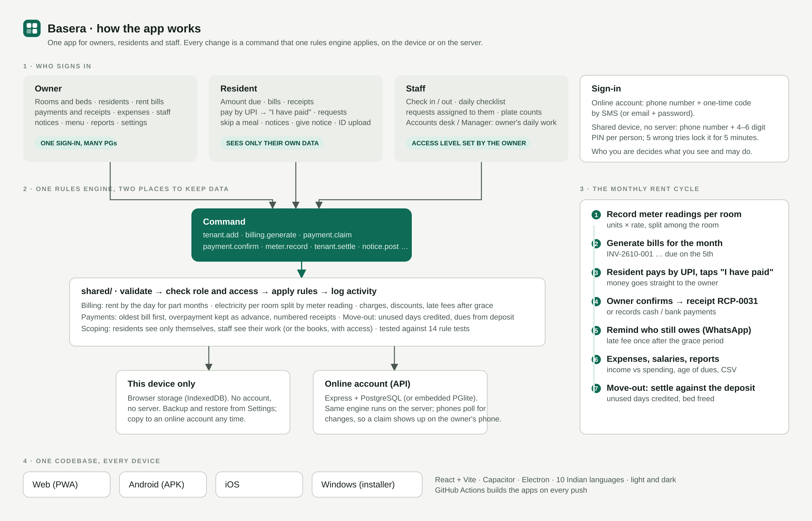

# Basera

PG and hostel management for owners, residents and staff in one app: web, Android, iOS and Windows from the same code, in ten Indian languages.



## What it does

**Owner**
- Room map by floor with every bed coloured by rent status; add a room or a whole floor.
- Residents with ID details, documents, deposit, room changes, notice and move-out.
- Monthly rent bills: part-months charged by the day, electricity split per room from meter readings, extra charges and discounts, late fees after a grace period.
- Payments by UPI, cash, bank or cheque with numbered receipts. Money is applied to the oldest bill first; overpayment is kept as advance.
- Residents tap "I have paid" after a UPI transfer; the owner confirms or rejects. The app never holds money.
- Move-out settlement: credit for unused days, dues taken from the deposit, deductions, refund statement.
- Expenses, staff attendance, salary slips (posted to expenses), daily work checklists.
- Requests from residents with assignment to staff, notices with "seen by", weekly menu and meal headcount.
- Reports: income and expenses, age of dues, payment modes, joiners and leavers; CSV export; backup and restore.

**Resident** signs in with the phone number the owner registered: amount due, bills, receipts, pay by UPI, raise requests, skip a meal, give notice, upload ID.

**Staff** sign in the same way: check in and out, tick off the day's work, handle requests, see plate counts, edit the menu (kitchen roles), view salary slips.

## Who can do what

- **One owner, many PGs**: sign in once; "My PGs" in the menu switches between them or adds another. No second registration.
- **Staff access levels**, set per person by the owner: *Own work only* (attendance, checklist, requests), *Accounts desk* (add residents, bills, record and confirm payments, expenses) or *Manager* (accounts desk plus rooms, move-outs, notices, staff attendance). Settings, staff records, salaries and deleting payments always stay with the owner. Every receipt and activity entry carries the name of whoever did it.
- **Sign-in**: online accounts use a one-time code sent by SMS (or email and password). On a shared device without a server, each number needs a 4 to 6 digit PIN: the owner chooses theirs at setup and sets one for each resident or staff member; five wrong tries lock that number for five minutes.

## Two ways to keep data

- **This device only**: no account or server. Data is stored in the browser (IndexedDB). Back up from Settings.
- **Online account**: run the API; people sign in with a one-time code on their own phones. A device-only PG can be copied online from Settings.

Both run the same rules, because every change goes through one reducer in `shared/`.

## Layout

| Folder | What |
| --- | --- |
| `shared/` | Domain: validation, billing engine, command reducer, role scoping, sample data, tests |
| `backend/` | Express API: OTP sign-in, sessions, property documents in PostgreSQL (or embedded PGlite), files |
| `frontend/` | React app (Vite), Capacitor projects in `android/` and `ios/` |
| `desktop/` | Electron shell for Windows, macOS, Linux |
| `tests/e2e.mjs` | Browser test of the whole product against the real API |

## Run it

```bash
npm install
npm run dev          # API on :4000 (embedded database, OTP 123456), app on :5173
npm test             # domain + API tests
npm run build && npm run test:e2e   # 37 browser checks (needs Playwright's Chromium)
npm run check:locales
```

## Deploy (online accounts)

```bash
POSTGRES_PASSWORD=choose-one docker compose up --build   # app + PostgreSQL on :4000
```

or connect the repo to Render (`render.yaml`). Settings are in `backend/.env.example`. For real SMS set `OTP_PROVIDER` to `msg91`, `twilio` or `webhook`. Never set `ALLOW_DEV_OTP` on a live server.

## Apps

- **Android / Windows / iOS check**: pushed commits build in GitHub Actions (`.github/workflows/build-apps.yml`). Set the repository variable `APP_API_URL` (for example `https://your-server/api`) so the apps talk to your server; without it they work in device mode.
- **Android locally**: `npm run build && cd frontend && npx cap sync android && cd android && ./gradlew assembleDebug`. Release signing reads `android/keystore.properties` (git-ignored) or `ANDROID_KEYSTORE_*` variables.
- **Windows locally**: `npm run build && cd desktop && npm install && npm run build:win` (on Windows, or Linux with Wine).
- **iOS**: `npx cap sync ios`, open `frontend/ios/App` in Xcode on a Mac and sign with your Apple team.

## Notes

Translations other than English were machine-drafted and should be read by a native speaker before a public launch. App id is `in.basera.app`; change it in `frontend/capacitor.config.ts`, `frontend/android/app/build.gradle` and `desktop/electron-builder.yml` if you pick another name.
